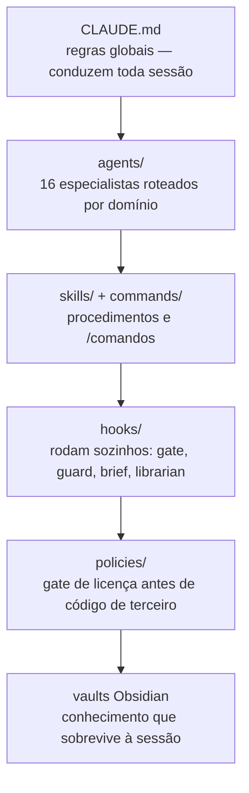
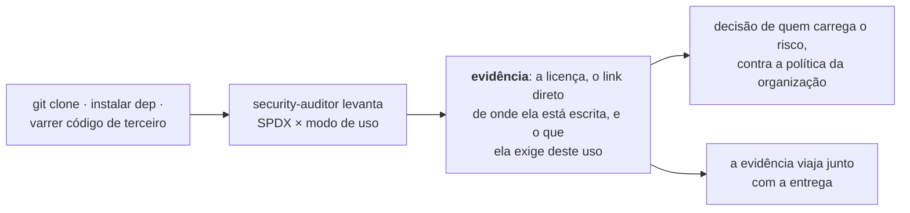
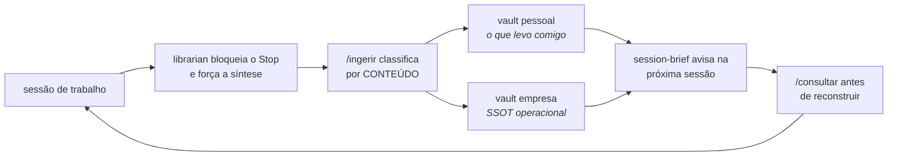

# BeOnSafe Claude Structure

> Uma configuração completa de Claude Code — 16 agentes, 10 skills, 3 commands, 8 hooks e
> um pipeline de conhecimento — com instalador guiado que explica cada peça antes de
> instalar.

[](LICENSE)
[](https://claude.com/claude-code)
[](https://github.com/ericvasr/beonsafe-claude-structure)

```bash
git clone https://github.com/ericvasr/beonsafe-claude-structure
cd beonsafe-claude-structure
./install.sh
```

O instalador é cadenciado de propósito: pergunta o seu nome, sugere onde ficam projetos
e vaults, e apresenta cada agente, skill e hook antes de escrever qualquer coisa —
dizendo o que a peça passa a fazer sozinha. Você recusa o que não quiser e segue.

`--dry-run` mostra tudo sem tocar em nada. `--yes` aceita os padrões. Rodar duas vezes
não duplica nem estraga: arquivo que você editou é preservado com aviso.

---

## O que vem junto

| Componente | Quantidade | Onde |
|---|---|---|
| Agentes especializados | **16** | [`agents/`](agents/) |
| Skills | **10** | [`skills/`](skills/) |
| Commands | **3** | [`commands/`](commands/) |
| Hooks | **8** | [`hooks/`](hooks/) |
| Docs de premissa | **3** | [`docs/`](docs/) |
| Política de licença | **1** | [`policies/`](policies/) |

Dependências de terceiros são **referenciadas, nunca redistribuídas** — cada uma se
instala da fonte oficial, sob a licença dela. Ver [`DEPENDENCIES.md`](DEPENDENCIES.md).

---

## Os agentes, por família

Roteamento automático: você descreve a tarefa, o Claude escolhe o especialista. Não
precisa chamar por nome.

**Infra e segurança** — [`agents/infra/`](agents/infra/)

| Agente | Entra quando |
|---|---|
| `security-auditor` | OWASP, secrets, hardening, e o **gate de licença obrigatório** antes de clonar código de terceiro |
| `infra-sre` | Servidor, rede, container, observabilidade, capacidade |
| `devops-pipeline` | Actions, Docker, deploy — e o rollback no mesmo desenho, não depois |

**Desenvolvimento** — [`agents/dev/`](agents/dev/)

| Agente | Entra quando |
|---|---|
| `dev-fullstack` | Arquitetura, refactor, revisão, performance |
| `api-designer` | Endpoint novo ou mudança de resposta — contrato antes do handler |
| `db-expert` | Schema, índice, migration, query lenta. Read-only em produção por trava de hook |
| `domain-modeler` | Regra com exceção, máquina de estados, o mesmo conceito com dois nomes |
| `test-engineer` | O que testar e em que nível; flaky; suíte lenta |

**Frontend** — [`agents/front/`](agents/front/)

| Agente | Entra quando |
|---|---|
| `front-scout` | **Antes** da primeira linha de UI: busca referência real, não desenha de memória |
| `front-critic` | **Antes** de dar a tela por pronta: screenshot em 3 viewports e Stranger Test |

**Operação — medem produção** — [`agents/operacao/`](agents/operacao/)

Read-only por trava de hook. Existem porque afirmar estado de produção a partir de repo,
doc ou memória é o erro que mais custa: repo e handoff envelhecem em dias.

| Agente | A pergunta que ele responde |
|---|---|
| `liveness-auditor` | O dado ainda está entrando? |
| `esteira-gate` | O CI valida o que diz validar? |
| `release-conductor` | O que está pronto e não protege ninguém? |
| `prod-posture` | O host está exposto? Credencial default? Compose untracked? |
| `slo-keeper` | Quanto do orçamento de erro sobrou? Cabe feature nova? |

**Arquitetura de IA** — [`agents/base/`](agents/base/): `ai-architect` — orquestração,
RAG, custo de inferência, desenho de skills e hooks.

---

## As skills

| Skill | O que faz |
|---|---|
| `/squad` | Despacha vários agentes em paralelo na mesma tarefa multi-domínio e sintetiza |
| `/incident` | Do alerta ao postmortem: triagem, mitigação, timeline, ações com dono |
| `/runbook` | Gera e executa procedimento passo a passo com comando de verificação |
| `/infra-audit` | Auditoria de host, container, rede e certificado |
| `/sec-scan` | Scanning consolidado: imagem, filesystem, IaC, segredo, dependência, SBOM |
| `humanizer` | Tira o registro de texto de IA da prosa que outra pessoa vai ler |
| `front` | Orquestrador de design: descoberta → arquitetura → criação → verificação |
| `gsap` | Timeline, ScrollTrigger, pin e scrub — quando a animação **é** o produto |
| `motion` | Animação declarativa em React: variants, AnimatePresence, layout animation |
| `threejs` | Cena 3D e WebGL: partículas, shader, GLTF, dispose, fill rate |

`gsap`, `motion` e `threejs` são autorais e MIT. A skill **`front` é uma composição**
que integra quatro projetos de terceiros — o crédito de cada um, com licença e o que ela
exige, está em [`skills/front/PROCEDENCIA.md`](skills/front/PROCEDENCIA.md).

As três de animação respondem *como* animar. Quem decide *se* cabe biblioteca é o
`front`, em `references/motion-libs.md`, que tem a escada CSS → nativo → lib e o gate de
licença antes do `npm i`.

---

## Como as camadas se encaixam



## Licença de terceiro — evidência, não bloqueio



O gate **não interrompe trabalho**. Ele impede o modo de falha real, que não é usar código
permissivo demais — é código de terceiro entrar sem ninguém saber de onde veio.

`policies/license-policy.md` é um **template de política**, e a restrição que ele descreve
é a escolha de uma organização com produto proprietário distribuído comercialmente. Edite
para o seu caso: uma consultoria que entrega o código ao cliente tem tolerância diferente
de um SaaS, e as duas diferem de um projeto interno que nunca é distribuído.

A skill `front` pratica o mesmo princípio em `references/source-registry.md`: cada fonte de
componente vem com o link do `LICENSE` e a obrigação ao lado, sem veredicto que barra.

## O ciclo de conhecimento



O fim de sessão é automático — o librarian bloqueia e força a síntese. O começo não é:
se você não puxar, o conhecimento entra e nunca sai. Essa assimetria é onde o setup mais
falha na prática, e por isso o `session-brief` existe.

Dois vaults, não um com duas pastas: [`docs/obsidian.md`](docs/obsidian.md) explica por
quê, e como abrir cada um.

---

## Os hooks, e o que cada um passa a fazer sozinho

Hook é diferente de skill: roda **sem você pedir**, em toda sessão, em qualquer
diretório. Por isso o instalador apresenta um a um com o gatilho declarado.

| Hook | Gatilho | O que faz |
|---|---|---|
| `statusline.sh` | render da barra | modelo, diretório, modo ativo |
| `session-brief.sh` | SessionStart | avisa se a wiki já tem página sobre este diretório. Silencioso quando não tem |
| `code-review-gate.sh` | SessionStart + Stop | grava o marco zero e, no fim de sessão que tocou código, pede o review. Bloqueia no máximo 2x |
| `review-voice-guard.sh` | PreToolUse `Bash` | intercepta `gh pr comment` e afins: nega assinatura de IA antes de publicar |
| `librarian-inbox.sh` | PostToolUse `Write\|Edit` | enfileira o que mudou |
| `librarian-session-end.sh` | Stop | bloqueia o encerramento e força a síntese para a wiki |
| `wiki-detect.sh` | chamado pelos outros | resolve qual vault vale a partir do diretório |
| `sync-configs.sh` | SessionStart | sincroniza settings entre WSL e Windows (opcional) |

Três coisas que só aparecem operando, e viraram desenho:

**Hook sem `+x` falha em silêncio.** O sintoma é "o gate nunca dispara", e ninguém liga
isso ao bit de execução. O instalador aplica `chmod +x` e valida.

**Config declarada não é config em vigor.** Linha no `settings.json` não prova que o
hook rodou — a evidência é linha no log.

**O `env` do `settings.json` vaza para o processo vivo** e não sai ao reverter o
arquivo. Depois de mexer nele, teste em sessão nova, senão você mede o estado errado e
conclui o oposto.

---

## Baseline de segurança de API

Todo trabalho que toque endpoint, autenticação ou sessão segue
[`docs/baseline-seguranca-api.md`](docs/baseline-seguranca-api.md): injeção, rate limit e
lockout por escopo, enumeração de usuário, token fora da URL, logout que invalida no
servidor, CORS por allowlist, resposta montada por DTO, criptografia da biblioteca
padrão, SLI/SLO.

Query parametrizada não é adiável — nem em protótipo. Ausência de item da baseline é
**achado com severidade**, não "ainda não implementado".

---

## Estrutura

```
beonsafe-claude-structure/
├── install.sh              instalador guiado e idempotente
├── settings.fragment.json  o que é mesclado no seu settings.json
├── CLAUDE.md               template das regras globais
├── agents/                 16 agentes em 5 famílias
├── skills/                 10 skills (6 próprias + front + 3 de animação)
├── commands/               /consultar /ingerir /lint
├── hooks/                  8 hooks
├── policies/               política de licença + allowlist
├── examples/               products.example.json — o portfólio que os agentes medem
├── wiki/                   templates de vault
└── docs/                   obsidian, baseline de API, premissas, precedência
```

---

## Visibilidade

Nenhum componente aqui telemetra ou faz "phone home". A visibilidade é nativa do Claude
Code — a statusline e os anúncios "Using [skill]" mostram o que está ativo em tempo real
— e do GitHub, pelas estrelas, forks e a aba Insights → Traffic.

Nenhum passo do [`SETUP.md`](SETUP.md) envia dados. Se o setup foi útil, o convite é dar
uma ⭐ ou abrir uma Discussion contando o caso de uso — por conta própria, nunca
automático.

---

## Licença

Conteúdo original sob [MIT](LICENSE) — copyright Eric Ribeiro (BeOnSafe).

Dependências de terceiros referenciadas, não redistribuídas, mantêm as próprias
licenças. Lista completa com origem e SPDX em [`DEPENDENCIES.md`](DEPENDENCIES.md).
