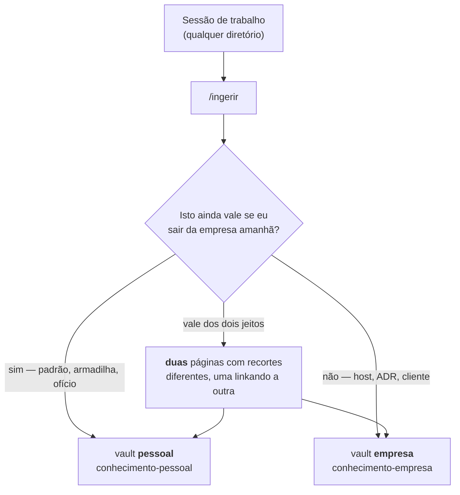

# Obsidian — instalar e abrir os dois vaults

O `install.sh` já criou as pastas. O Obsidian é o leitor: ele não é obrigatório para o
pipeline funcionar, mas sem ele você escreve conhecimento que nunca vai reler — e
conhecimento que ninguém relê é custo, não acervo.

---

## Por que dois vaults, e não um com duas pastas



Uma pasta dentro de um vault só não separa nada de verdade: no dia em que você entrega
o notebook, o vault inteiro vai junto — inclusive o que era seu. Dois vaults são duas
pastas independentes, com histórico próprio e sincronização própria. A separação é
física porque a consequência é física.

A regra que decide o destino é sempre a mesma pergunta, e ela é sobre **conteúdo**,
nunca sobre o diretório onde a sessão rodou. O mesmo incidente costuma render duas
páginas: no pessoal, o padrão sem citar cliente; na empresa, o sistema com host e
versão.

---

## Instalar

**Linux (Debian/Ubuntu)** — baixe o `.AppImage` em [obsidian.md/download](https://obsidian.md/download):

```bash
mkdir -p ~/Apps && cd ~/Apps
chmod +x Obsidian-*.AppImage
./Obsidian-*.AppImage
```

**WSL** — instale a versão **Windows**, não a Linux. O Obsidian no WSL sem servidor
gráfico não abre, e os vaults ficam acessíveis pelo Windows em `\\wsl$\...` de qualquer
jeito. Se preferir que o Windows enxergue os vaults sem prefixo de rede, crie-os em
`/mnt/c/Users/<você>/Documents/vaults` e passe esse caminho ao instalador:

```bash
VAULTS_ROOT=/mnt/c/Users/$USER/Documents/vaults ./install.sh
```

**macOS**: `brew install --cask obsidian`. **Windows**: `winget install Obsidian.Obsidian`.

---

## Abrir os dois vaults

Na tela inicial do Obsidian, o painel tem três opções. A que interessa é a do meio.

```
┌─────────────────────────────────────────────┐
│  Obsidian                                   │
│                                             │
│   📁  Create new vault                      │
│       Criar do zero — NÃO use aqui.         │
│                                             │
│   📂  Open folder as vault      ← esta      │
│       As pastas já existem e já têm         │
│       .wikiconfig.json dentro.              │
│                                             │
│   ☁️  Open vault from Obsidian Sync         │
│                                             │
└─────────────────────────────────────────────┘
```

1. **Open folder as vault** → navegue até `~/vaults/conhecimento-pessoal` → abrir.
2. O Obsidian pergunta se confia no autor do vault. É seu: **Trust author and enable
   plugins**.
3. Repita para `~/vaults/conhecimento-empresa`.

Trocar entre os dois depois: ícone do cofre no canto inferior esquerdo → o outro vault.
Os dois ficam na lista para sempre.

Se o caminho não for o padrão, ele está gravado em `~/.claude/wiki/vaults.json`:

```bash
jq -r '.vaults[] | "\(.id)\t\(.raiz)"' ~/.claude/wiki/vaults.json
```

---

## O que você vai ver dentro

```
conhecimento-pessoal/
├── .wikiconfig.json      ← o marcador. É ele que faz o pipeline achar o vault.
├── wiki/
│   ├── index.md              índice, mantido pelo /ingerir
│   ├── log.md                uma linha por ingestão, mais recente no topo
│   ├── meta/inbox/           fila do librarian entre a sessão e a ingestão
│   ├── desenvolvimento/      padrão de código, arquitetura, armadilha
│   ├── domains/              conhecimento de domínio
│   ├── leituras/             o que você leu e o que ficou
│   ├── projetos-pessoais/
│   ├── projetos-trabalho/
│   ├── temas/  metas/  atividades/  feedbacks/
└── raw/                  fonte bruta antes de virar página
    └── artigos/ leituras/ notas/ feedbacks/ videos/
```

**Não apague o `.wikiconfig.json`.** O `wiki-detect.sh` sobe a árvore de diretórios
procurando esse arquivo para decidir em qual vault escrever. Sem ele, o vault fica
invisível para o pipeline e tudo cai no fallback — silenciosamente.

---

## Plugins que valem a pena

Nenhum é obrigatório. Estes três resolvem problemas que aparecem já na segunda semana:

| Plugin | O que resolve |
|---|---|
| **Dataview** | Transforma o vault em consulta. `LIST FROM "wiki/desenvolvimento" SORT file.mtime DESC` responde "o que escrevi por último" sem procurar. |
| **Git** | Commit automático do vault. É o que dá história ao conhecimento — quando você reler uma página em seis meses, o diff diz por que ela mudou. |
| **Templater** | Cabeçalho padrão nas páginas novas. Vale quando o volume passa de umas 50 páginas. |

Instalar: Settings → Community plugins → Turn on → Browse.

Para o Git, um `.gitignore` no vault com `.obsidian/workspace.json` evita commit a cada
vez que você move um painel.

---

## O ciclo completo, uma vez


O fim de sessão é automático: o librarian **bloqueia** o `Stop` e força a síntese. O
começo não é — o `session-brief.sh` só avisa que existe página sobre aquele diretório.
Ver o aviso é o gatilho para rodar `/consultar <tema>` antes da primeira edição.

Essa assimetria é de propósito, e é onde o setup mais falha na prática: sem o hábito de
consultar, o conhecimento entra e nunca sai. O registro costuma estar mais certo que a
sua reconstrução de memória.

---

## Quando não funciona

| Sintoma | Causa quase sempre |
|---|---|
| `/ingerir` escreve no vault errado | `.wikiconfig.json` ausente ou com `id` trocado na raiz do vault |
| Nada é ingerido no fim da sessão | `LIBRARIAN_MIN_CHANGES` alto demais, ou o hook `Stop` não registrado — confira com `jq '.hooks.Stop' ~/.claude/settings.json` |
| `session-brief` nunca aparece | Comportamento correto: ele é silencioso em diretório sem histórico |
| Obsidian não vê as páginas novas | O vault foi aberto na pasta errada — a raiz é a que contém `.wikiconfig.json`, não a `wiki/` de dentro |

Antes de concluir que um hook está quebrado, confira o log em vez do `settings.json`.
Config declarada não é config em vigor:

```bash
tail -20 ~/.claude/logs/*.jsonl
```
